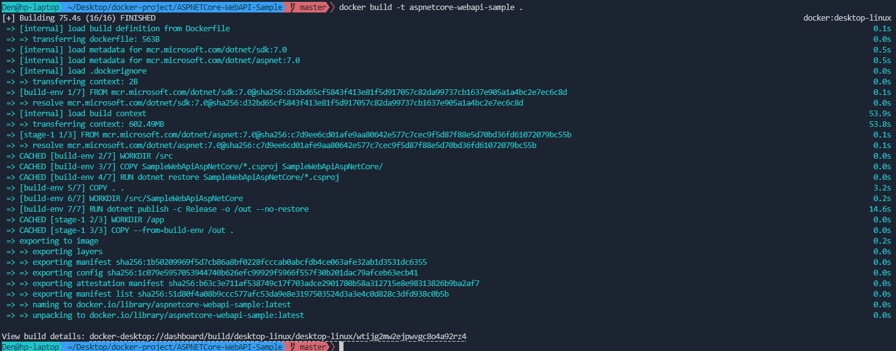
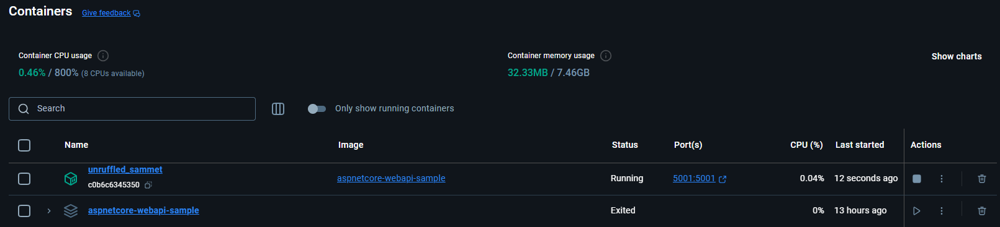
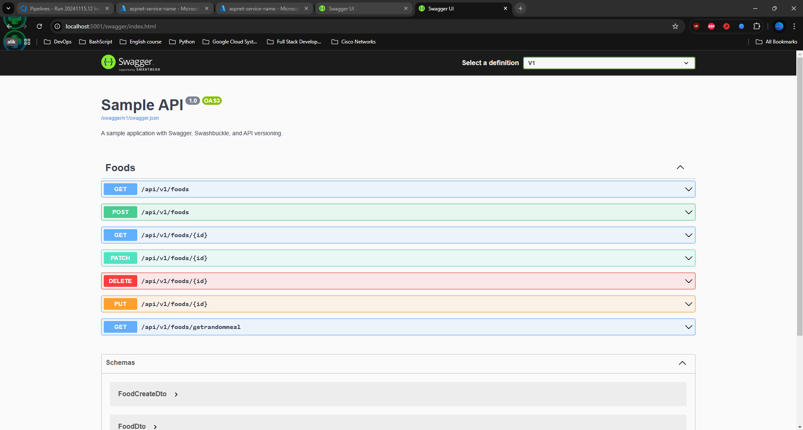
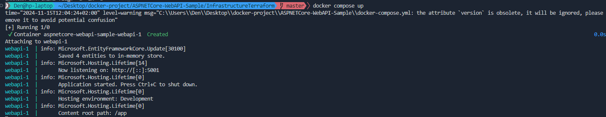
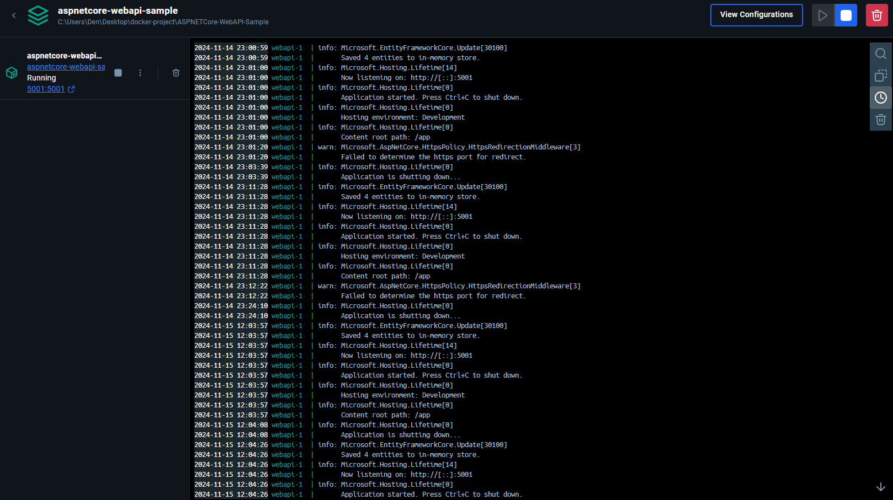
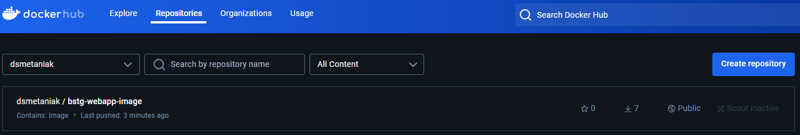
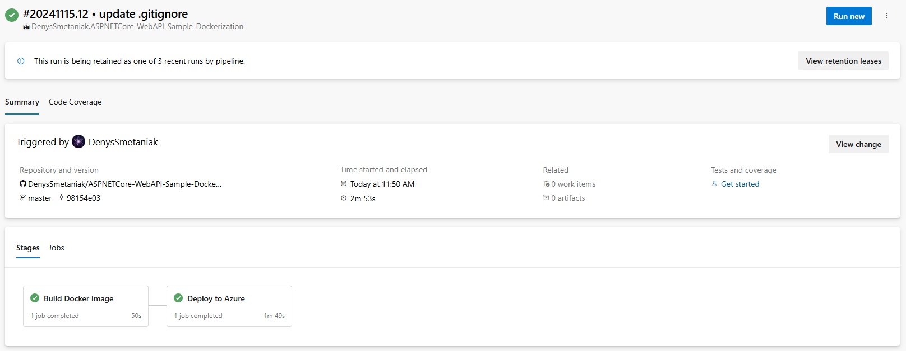
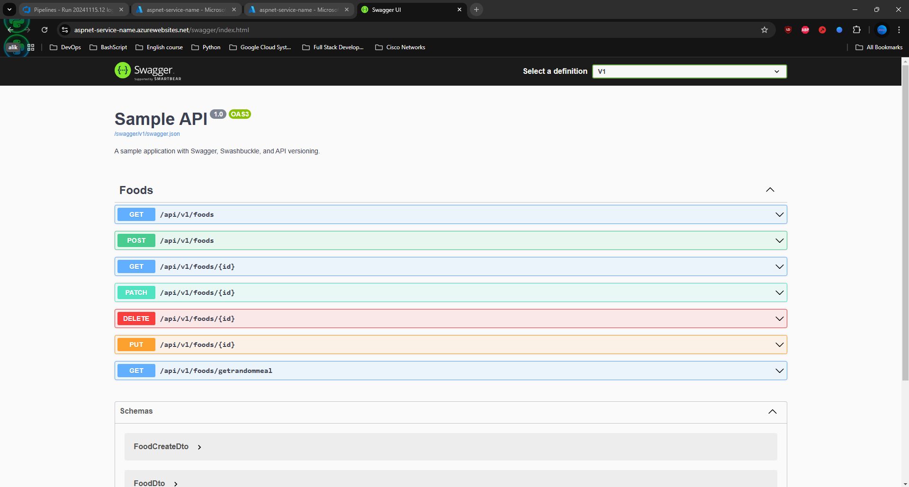

# Dockerized ASP.NET Core WebApi Sample with HATEOAS, Versioning & Swagger

1) You need to create your own repo in Github and clone https://github.com/FabianGosebrink/ASPNETCore-WebAPI-Sample"
2) Create a Dockerfile that will build application and run it. 
3) Create a dockercompose.yml file that will inlude build (use local build context) and run stages, for local testing purposes, commit this file to repo. 
4) Write your own Azure DevOps build flow using yaml syntax and commit it into your GitHub repo. Build and deploy from the main branch. Build on PR.
5) Although you have multiple options to deploy the dockerized application, your manager heard about Azure App Service and knows that you have Terraform code for that. You should determine whether it's necessary to use the old Terraform code, Terraform code with modified configuration, or choose another platform and write Terraform code for it. Although you should write Terraform configuration, there's no requirement to implement CI/CD for it (but you can use your previous pipelines to address this and bring additional value)

See details report here: 

## Dockerfile



## Run locally





## Docker-compose





## Published images into DockerHub for using with Terraform

```terraform
  resource "azurerm_app_service" "app" {
  name                = var.app_service_name
  location            = azurerm_resource_group.rg.location
  resource_group_name = azurerm_resource_group.rg.name
  app_service_plan_id = azurerm_app_service_plan.app_service_plan.id

  site_config {
    linux_fx_version = "DOCKER|dsmetaniak/bstg-webapp-image:latest"
  }

  app_settings = {
    WEBSITES_ENABLE_APP_SERVICE_STORAGE = "false"
  }
}
```



## Report pipeline



## Run WebApp


